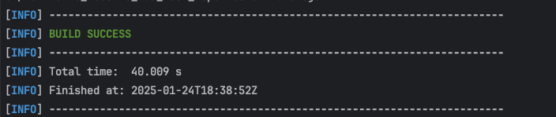
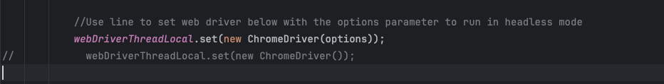
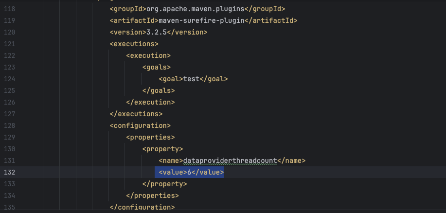

# BDD Test Automation Repository for Portfolio Site

## Overview

This repository contains the BDD test automation framework developed to ensure the quality and functionality of my portfolio website. The framework is designed to validate key features, user interactions, and expected behaviors using Behavior-Driven Development principles. It provides an easy-to-understand approach to writing and executing tests, leveraging Gherkin syntax for defining feature files.



Link to site: [Portfolio Site](https://haydeneubanks.co.uk/index.php)

---

## Prerequisites

- Java 23
- Maven
- Allure


---

## Key Features

- **Behavior-Driven Development (BDD):** Test cases are defined in Gherkin, promoting collaboration and clarity.
- **Multi Threading:** Tests can be run in parallel to vastly increase speed of testing.
- **Page Object Model (POM):** Modular design for maintainable and scalable tests.
- **Automation Framework:** Built with modern testing libraries and tools.
- **Comprehensive Reporting:** Test Report is automatically generated by integrating Allure reporting.
- **Easy Setup and Execution:** Streamlined for developers and QA engineers.

---

## Technologies Used

- **Programming Language:** Java
- **BDD Framework:** Cucumber, Selenium
- **Test Runner:** TestNG
- **Browser Automation:** Selenium
- **Web Driver:** Chrome
- **Reporting Tool:** Allure

---
## Instructions For Use

1. Install repository on local machine
2. (Optional) Currently in headless mode, but to see browser actions reverse lines in testContext file as outlined below
   
3. (Optional) To modify rate of concurrency, set the thread number from the surefire plugin in the pom as shown below
   
4. Run the command ```mvn clean install``` from the terminal
5. To see report run the command ```allure serve```
6. To save the report run the command ```allure generate```

---

## Future Improvements

- **Increase test coverage:** Increase test pack to increase test coverage and provide even more comprehensive testing.
- **Multi-Browser Support:**  Supports multiple browsers to ensure wider compatibility.
